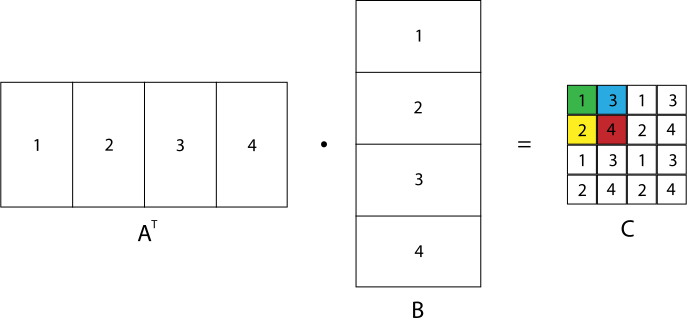
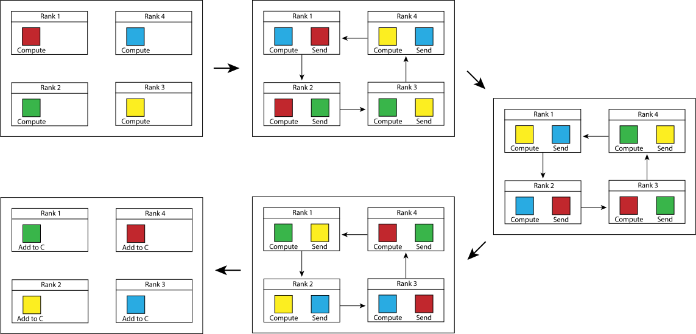
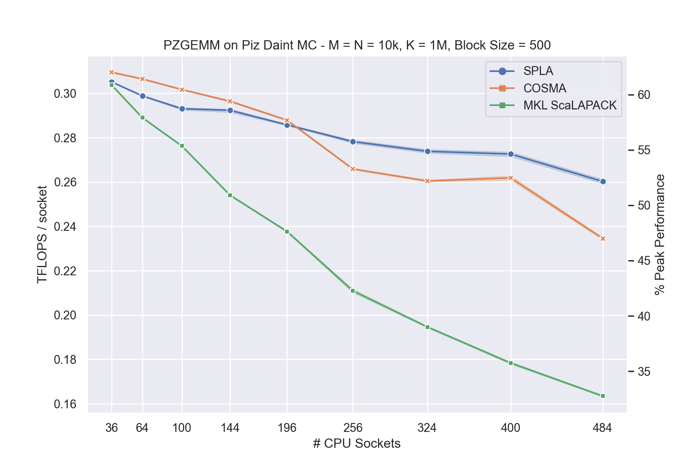
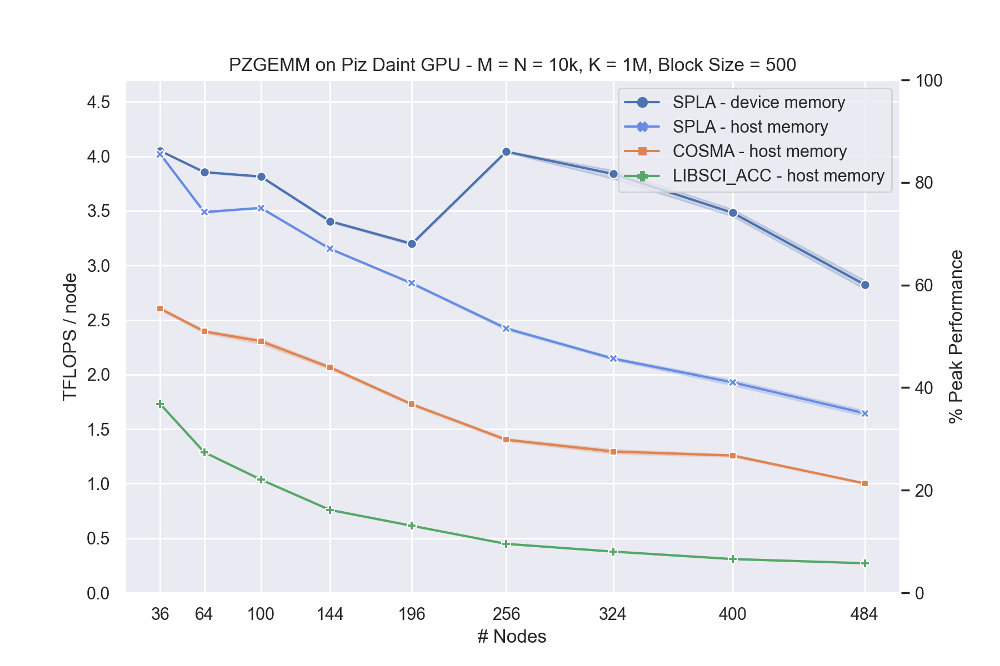

[](https://github.com/eth-cscs/spla/actions?query=workflow%3ACI)
[](https://spla.readthedocs.io/en/latest/?badge=latest)

# SPLA - Specialized Parallel Linear Algebra
SPLA provides specialized functions for linear algebra computations with a C++ and C interface, which are inspired by requirements in computational material science codes.

Currently, SPLA provides functions for distributed matrix multiplications with specific matrix distributions, which cannot be used directly with a ScaLAPACK interface.
All computations can optionally utilize GPUs through CUDA or ROCm, where matrices can be located either in host or device memory.

## Contents
- [Functionality](#Functionality)
     - [Local GEMM](#Local-GEMM)
     - [Stripe-Stripe-Block](#Stripe-Stripe-Block)
     - [Stripe-Block-Stripe](#Stripe-Block-Stripe)
- [Documentation](#Documentation)
- [Installation](#Installation)
- [Implementation Details](#Implementation-Details)
- [Benchmark](#Benchmark)
- [Example](#Example)
- [Acknowledgements](#Acknowledgements)

## Functionality
### Local GEMM
The function `gemm(...)` computes a local general matrix product, that works similar to cuBLASXt. If GPU support is enabled, the function may take any combination of host and device pointer. In addition, it may use custom multi-threading for computations on host, if the provided BLAS library does not support multi-threading.

### Stripe-Stripe-Block
The `pgemm_ssb(...)` function computes

<p align="center"></p>


where matrices A and B are stored in a "stripe" distribution with variable block length. Matrix C can be in any supported block distribution, including the block-cyclic ScaLAPACK layout. Matrix A may be read as transposed or conjugate transposed.

<p align="center"></p>

For computation of triangular block distributed matrices, the `pgemm_ssbtr(...)` function is available, allowing to specify the fill mode of C.

### Stripe-Block-Stripe
The `pgemm_sbs(...)` function computes

<p align="center"></p>

where matrices A and C are stored in a "stripe" distribution with variable block length. Matrix B can be in any supported block distribution, including the block-cyclic ScaLAPACK layout.

<p align="center"></p>

## Documentation
Documentation can be found [here](https://spla.readthedocs.io/en/latest/).

## Installation
The build system follows the standard CMake workflow. Example:
```console
mkdir build
cd build
cmake .. -DSPLA_OMP=ON -DSPLA_GPU_BACKEND=CUDA -DCMAKE_INSTALL_PREFIX=${path_to_install_to}
make -j8 install
```

### CMake options
| Option                |  Values                                                  | Default | Description                                      |
|-----------------------|----------------------------------------------------------|---------|--------------------------------------------------|
| SPLA_OMP              |  ON, OFF                                                 | ON      | Enable multi-threading with OpenMP               |
| SPLA_HOST_BLAS        |  AUTO, MKL, OPENBLAS, BLIS, CRAY_LIBSCI, ATLAS, GENERIC  | AUTO    | BLAS library for computations on host            |
| SPLA_GPU_BACKEND      |  OFF, CUDA, ROCM                                         | OFF     | Select GPU backend                               |
| SPLA_BUILD_TESTS      |  ON, OFF                                                 | OFF     | Build test executables                           |
| SPLA_INSTALL          |  ON, OFF                                                 | ON      | Add library to install target                    |
| SPLA_FORTRAN          |  ON, OFF                                                 | OFF     | Build Fortan module                              |

## Implementation Details
The implementation is based on a ring communication pattern as described in the paper [Accelerating large-scale excited-state GW calculations on leadership HPC systems](https://dl.acm.org/doi/10.5555/3433701.3433706) by Mauro Del Ben Et Al. For distributed matrix-matrix multiplications with distributions as used in the `pgemm_ssb` function, each process contributes to the result of every element. Therefore, some form of reduction operation is required. Compared to other reduction schemes, a ring requires more communication volume. However, by splitting up the result and computing multiple reductions concurrently, all processes share the work load at every step and more opportunities for communication - computation overlap arise.
Let's consider the example of computing a block cyclic distributed matrix with the `pgemm_ssb` function on four ranks. The following image illustrates how the matrices are distributed, with the numbers indicating the assigned rank of each block:
<p align="center"></p>

To compute the colored blocks using the ring communication pattern, each rank starts computing a different block. The result is then send to a neighbouring rank, while at the same time, the next block is being computed. When result of another rank is received, the local contribution is added, and the block send onwards:
<p align="center"></p>

Ideally, the location of a block at the last step is also where it has to be written to the output. However, internally SPLA uses independent block sizes and a final redistribution step is required. This allows more flexibility, since for the communication pattern to work optimally, the number of blocks has to be a multiple of the number of ranks. In addition, to maximize overlap, SPLA may process several groups of blocks in parallel, interleaving steps of the ring pattern for each group.
For the function `pgemm_sbs`, the pattern is applied in reverse, i.e. a broadcast operation is performed in a ring. The benefits are similar, but a redistribution step is required at the beginning instead, to allow for optimal internal block sizes.

## Benchmark
The most commonly used API for distributed matrix multiplication is based on ScaLAPACK. To allow a comparison to other libraries, parameters for the benchmark of the `pgemm_ssb` function are selected, such that the same operation can be expressed in a `p?gemm` call through a ScaLAPACK interface. Matrices A and B are set to use a fixed block size and matrix C to use the same one dimensional processor grid as A and B.
Two types of compute nodes on Piz Daint at CSCS were used:
|     | Piz Daint - Multi-Core                             | Piz Daint - GPU                            |
|-----|----------------------------------------------------|--------------------------------------------|
| CPU | 2 x Intel Xeon E5-2695 v4 @ 2.10GHz (2 x 18 cores) | Intel Xeon E5-2690 v3 @ 2.60GHz (12 cores) |
| GPU |                                                    | NVIDIA Tesla P100 16GB                     |

The CPU benchmarks were run on the multi-core partition, with two MPI ranks per node, such that each process had a single CPU socket with 18 threads available. The GPU benchmarks were run on the GPU partition, with one MPI rank per node.
The matrix sizes were selected to represent a "tall and skinny" case, as typically used in computational material science simulations.

<p align="center"></p>

The plots show the performance per node / socket, with the CPU benchmark on the left and the GPU benchmark on the right.<br/>
On **CPU**, performance is much better compared to Intel MKL and similar to [COSMA](https://github.com/eth-cscs/COSMA), which is a library based on a communication optimal algorithm. At a low number of MPI ranks, COSMA will use larger internal blocks compared to SPLA, which is constraint by the requirement to assign at least one block to each rank to form a ring communication pattern. Larger blocks allow for overall faster local computations, since a single `zgemm` call to the BLAS library is more efficient than multiple calls with smaller sizes. With increasing number of nodes, the computational load per node decreases, and communication costs become more pronounced. While theoretically, SPLA may have a higher communication volume compared to COSMA, it is able to hide the cost more effectively by only using direct communication with neighbours. Therefore, at higher node count, it outperforms the other libraries in this case.

On **GPU**, computations tend to be much faster, so communication cost is even more important. For all number of nodes in this benchmark, SPLA significantly outperforms COSMA and LIBSCI_ACC (a library provided by CRAY). Internally, SPLA is able to use multiple CUDA streams, which are only individually synchronized for communication through MPI. In contrast, COSMA uses multiple streams to compute a larger block, which are synchronized as a group for communication. Therefore, SPLA achieves much better overlap of computation and communication, in addition to overall faster individual communication steps. To compute the matrix multiplication, data on host is temporarily copied to the GPU. With increasing number of nodes, the internal block size of SPLA decreases, which then requires the same data to be copied more often. Hence, with data on host memory as input, the bandwidth between host and GPU memory becomes the limiting factor. The unique feature of SPLA is to ability to use data on device memory as input / output. In this case, the bandwidth is no longer a problem and communication cost is dominant. At 256 nodes, the message size for MPI communication falls below a threshold, below which the MPI implementation on Piz Daint uses a different protocol, leading to a significant performance jump. This is difficult to optimize for when selecting internal block sizes, but if optimum performance with fixed sizes required, a user can specify a target block size to use on their system.

## Example
This an examaple in C++, for C and Fortran check the [examples](examples) folder.
```
#include <vector>
#include <cmath>
#include <mpi.h>

#include "spla/spla.hpp"

int main(int argc, char** argv) {
  MPI_Init(&argc, &argv);
  int world_size = 1;
  MPI_Comm_size(MPI_COMM_WORLD, &world_size);

  int m = 100;
  int n = 100;
  int k_local = 100;

  int block_size = 256;
  int proc_grid_rows = std::sqrt(world_size);
  int proc_grid_cols = world_size / proc_grid_rows;

  std::vector<double> A(m * k_local);
  std::vector<double> B(n * k_local);
  std::vector<double> C(m * n); // Allocate full C for simplicity

  int lda = k_local;
  int ldb = k_local;
  int ldc = m;

  {
    // Create context, which holds any resources SPLA will require, allowing reuse between functions
    // calls. The given processing unit will be used for any computations.
    spla::Context ctx(SPLA_PU_HOST);

    // Create matrix distribution for C
    auto c_dist = spla::MatrixDistribution::create_blacs_block_cyclic(
        MPI_COMM_WORLD, 'R', proc_grid_rows, proc_grid_cols, block_size, block_size);
    // This is mostly equivalent to the following ScaLAPACK calls combined:
    /*
    int info = 0;
    int rsrc = 0;
    int csrc = 0;
    int blacs_ctx = Csys2blacs_handle(MPI_COMM_WORLD);
    Cblacs_gridinit(&blacs_ctx, 'R', proc_grid_rows, proc_grid_cols);
    int desc[9];
    descinit_(desc.data(), &m, &n, &block_size, &block_size, &rsrc, &csrc, &blacs_ctx, &ldc,
                  &info);
    */

    double alpha = 1.0;
    double beta = 0.0;

    // Compute parallel stripe-stripe-block matrix multiplication. To describe the stripe
    // distribution of matrices A and B, only the local k dimension is required.
    spla::pgemm_ssb(m, n, k_local, SPLA_OP_TRANSPOSE, alpha, A.data(), lda, B.data(), ldb, beta,
                    C.data(), ldc, 0, 0, c_dist, ctx);

  }  // Make sure context goes out of scope before MPI_Finalize() is called.

  MPI_Finalize();
  return 0;
}
```

## Acknowledgements
This work was supported by:


| | [**Swiss Federal Institute of Technology in Zurich**](https://www.ethz.ch/) |
|:----:|:----:|
| | [**Swiss National Supercomputing Centre**](https://www.cscs.ch/)            |
|  | [**MAterials design at the eXascale**](http://www.max-centre.eu) <br> (Horizon2020, grant agreement MaX CoE, No. 824143) |
