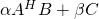
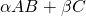

[](https://github.com/eth-cscs/spla/actions?query=workflow%3ACI)
[](https://spla.readthedocs.io/en/latest/?badge=latest)

# SPLA - Specialized Parallel Linear Algebra
SPLA provides specialized functions for linear algebra computations, which are inspired by requirements in computational material science codes.

The implementations is based on MPI and optinally utilized OpenMP and GPU acceleration through CUDA or ROCm.
## GEMM
Currently, two general matrix multiplication functions are available, which allow for different matrix distributions as input and output.
These specific configurations cannot be directly expressed with the commonly used p?gemm function of ScaLAPACK.

### Stripe-Stripe-Block
The `gemm_ssb(...)` function computes the following:  


The matrices A and B are stored in a "stripe" distribution with variable block length. Matrix C can be in any supported block distribution.
See documentation for details. 


     ------ H     ------
     |    |       |    |
     |    |       |    |
     ------       ------
     |    |       |    |        -------
     |    |       |    |        |  |  |
     ------   *   ------    +   -------
     |    |       |    |        |  |  |
     |    |       |    |        -------
     ------       ------           C
     |    |       |    |
     |    |       |    |
     ------       ------
       A            B


### Stripe-Block-Stripe
The `gemm_sbs(...)` function computes the following:  


The matrices A and C are stored in a "stripe" distribution with variable block length. Matrix B can be in any supported block distribution.
See documentation for details. 

     ------                     ------
     |    |                     |    |
     |    |                     |    |
     ------                     ------
     |    |       -------       |    |
     |    |       |  |  |       |    |
     ------   *   -------   +   ------
     |    |       |  |  |       |    |
     |    |       -------       |    |
     ------          B          ------
     |    |                     |    |
     |    |                     |    |
     ------                     ------
       A                          C

## Documentation
Documentation can be found [here](https://spla.readthedocs.io/en/latest/).

## Installation
The build system follows the standard CMake workflow. Example:
```console
mkdir build
cd build
cmake .. -DSPLA_OMP=ON -DSPLA_GPU_BACKEND=CUDA -DCMAKE_INSTALL_PREFIX=/usr/local
make -j8 install
```

### CMake options
| Option                | Default | Description                                      |
|-----------------------|---------|--------------------------------------------------|
| SPLA_OMP              | ON      | Enable multi-threading with OpenMP               |
| SPLA_GPU_BACKEND      | OFF     | Select GPU backend. Can be OFF, CUDA or ROCM     |
| SPLA_BUILD_TESTS      | OFF     | Build test executables for developement purposes |
| SPLA_INSTALL          | ON      | Add library to install target                    |

## Acknowledgements
The development of SPLA would not be possible without support of the following organizations:

| Logo | Name | URL |
|:----:|:----:|:---:|
| | Swiss Federal Institute of Technology in Zürich | https://www.ethz.ch/      |
| | Swiss National Supercomputing Centre            | https://www.cscs.ch/      |
|  | MAX (MAterials design at the eXascale) <br> European Centre of Excellence | http://www.max-centre.eu/   |
